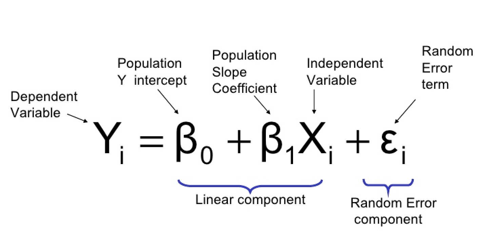

# Regression in R

This is a quick introduction to the concept of regression analysis. 

## Linear Regression 

Linear regression is a statistical method for obtaining a prediction of an outcome 
 
as a linear combination of the variables

multiplied by the parameter
, 
plus an intercept
.

### The Regression Equation

The parameters 
 
and

are estimated by minimizing the sum of squared residuals from the regression line defined by
 
and
.
The residuals are the differerences from the observed values 
 
from the values predicted by the regression line. 

### The Minimization Problem

### The Fit of a Regression Model

## Logistic Regression

### The Logistic Equation

### Comparison with Linear Probability Model

