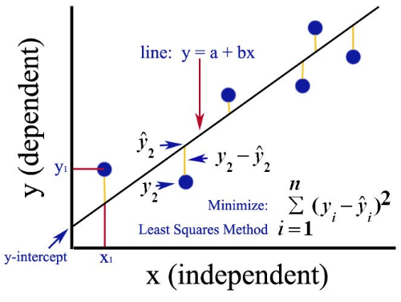

# Regression in R

This is a quick introduction to the concept of regression analysis. 

## Linear Regression 

Linear regression is a statistical method for obtaining a prediction of an outcome 
 
from an observed variable.

### The Regression Equation

The prediction takes the form of a linear equation for the prediction of 
 
as a linear combination of the variables

multiplied by the parameter
, 
plus an intercept
.

### The Minimization Problem

The parameters 
 
and

are estimated by minimizing the sum of squared residuals from the regression line defined by
 
and
.
The residuals are the differerences from the observed values 
 
from the values predicted by the regression line. 

### The Fit of a Regression Model

The quality of fit of a regression model is determined by the degree to which the observations fit close to the regression line. 
It is represented by the statistic 
, 
pronounced "R-squared."
This statistic ranges from 
, 
for a model that fits the data perfectly,
to 
, 
if the dependent variable 

is unrelated to the explanatory variable
.

## Logistic Regression

### The Logistic Equation

### Comparison with Linear Probability Model

