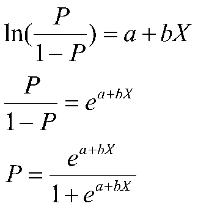

# Regression in R

This is a quick introduction to the concept of regression analysis. 

## Linear Regression 

Linear regression is a statistical method for obtaining a prediction of an outcome $y$

### The Regression Equation

### The Minimization Problem

### The Fit of a Regression Model

## Logistic Regression

### The Logistic Equation

### Comparison with Linear Probability Model

