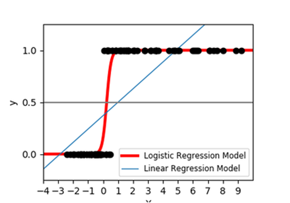

# Regression in R

This is a quick introduction to the concept of regression analysis. 

## Linear Regression 

Linear regression is a statistical method for obtaining a prediction of an outcome 
 
from an observed variable.

### The Regression Equation

The prediction takes the form of a linear equation for the prediction of 
 
as a linear combination of the variables

multiplied by the parameter
, 
plus an intercept
.

### The Minimization Problem

The parameters 
 
and

are estimated by minimizing the sum of squared residuals from the regression line defined by
 
and
.
The residuals are the differerences from the observed values 
 
from the values predicted by the regression line. 

### The Fit of a Regression Model

The quality of fit of a regression model is determined by the degree to which the observations fit close to the regression line. 
It is represented by the statistic 
, 
pronounced "R-squared."
This statistic ranges from 
, 
for a model that fits the data perfectly,
to 
, 
if the dependent variable 

is unrelated to the explanatory variable
.

## Logistic Regression

When the variable takes the form of a binary variable, i.e., it takes on only two values, say, 0 and 1, the linear regression model is not appropriate. 
The logistic regression model uses the logistic transformation to produce an estimate of the probability that 
.

### The Logistic Equation

The logistic equation also implies that the data are a transformation of a linear equation in

by applying the *logit* transformation:

### Comparison with Linear Probability Model

The prediction from a linear regression is called the *linear probability model* when it is used to predict binary events. 
Compared to the linear probability model, the logisti regression produces estimates of the probabilities that are constrained to lie between zero and one, as they should. 
In contrast, the predictions from the linear probability model will be greater than one and lower than zero for some values of 
.

### The Fit of a Logistic Regression Model

Another method is used to measure the quality of fit of a logistic regression model. 
A statistic called the *Area under the ROC Curve* is appropriate for this. 
The *AUROC* is interpreted as the probability that any pair of predictions is correctly ordered, when one observation is drawn from 

and one is drawn from
, 
where "correctly ordered" means that the prediction for the probability that

is higher than the prediction for the probability that
.

