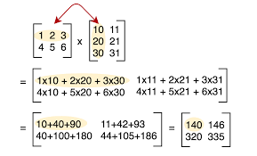
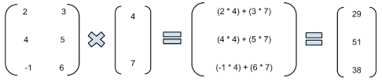
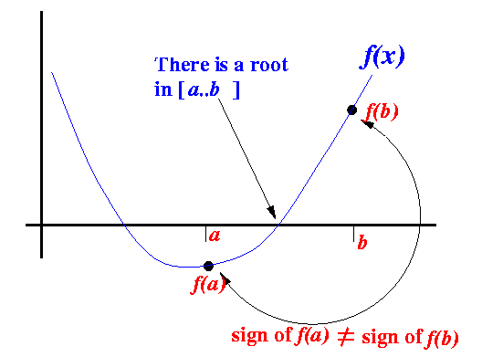
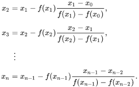
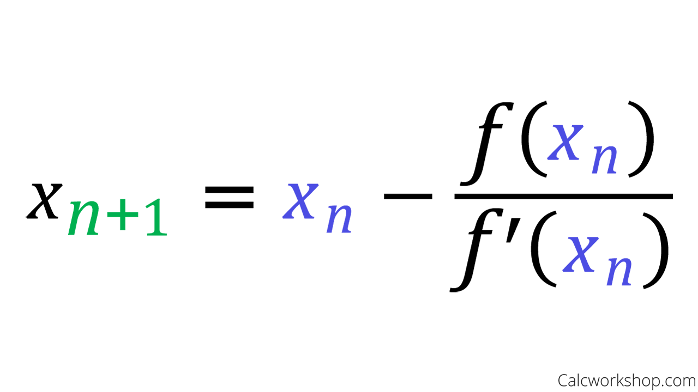
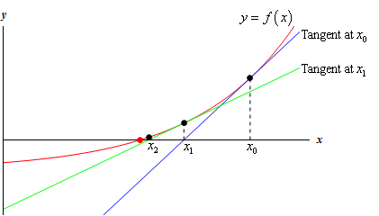
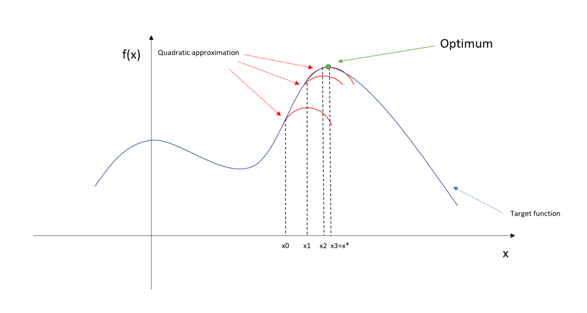
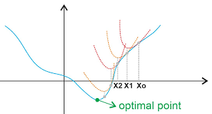
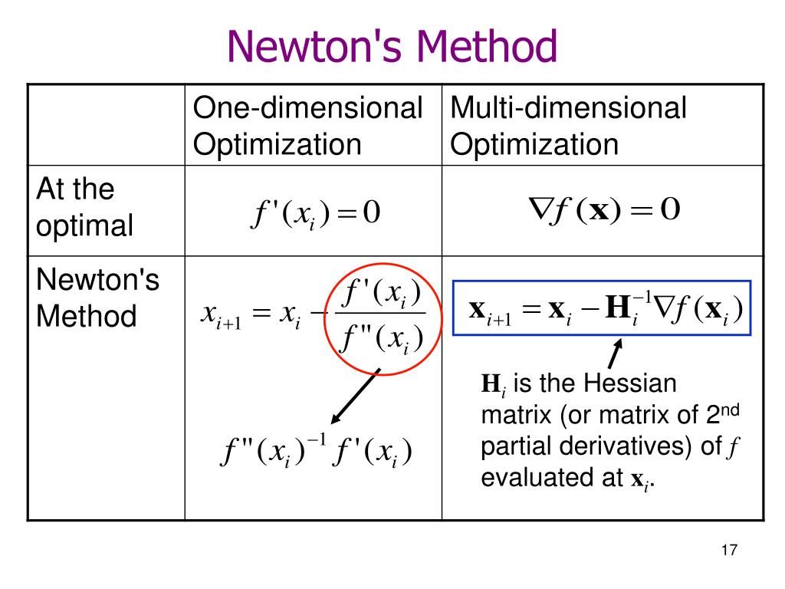

# Numerical Methods in R and Python


When using computers to solve a problem, one approach is to fully understand the solution before attempting to write a program to solve the problem.
It is often very useful to conceptualize the calculation first and then use a concise specification from which to write the program.
This approach takes advantage of the fast and reliable computation of modern computers: computers can perform calculations more quickly and reliably than humans can by hand.

However, computers are capable of much more.
The above approach is very limited in terms of the nature of problems that can be solved.
Computers can be used to solve problems that you don't know how to solve. 
You can use computers to help you understand a problem as you formulate a solution procedure. 
The most important ingredient is having a precise way of stating the problem. 
In the following we will consider three types of computing problems:

1. Solving a *system of linear equations* for a vector of unknown parameters. 
1. Finding the *root of a non-linear function*, i.e., a parameter input that returns a value of zero from that function. 
1. Solving an *optimization problem*: finding a parameter input that achieves the maximum or minimum value of a particular objective funtion. 


## Solving Linear Equations

### The problem

Solving a *system of linear equations* for a vector of unknown parameters. 
The objective is to find a *vector* ```x``` that, when multiplied by the *matrix* ```A``` produces the *vector* ```b```: ```x``` satisfies ```A %*% x == b```.
An inefficient way to solve this problem is to find the *invers* of the matrix ```A``` and multipy it against ```b```. 
This works but it takes many more computational steps. 







### The solution


### Examples


In the linear regression model, the objective is to find the value of the coefficients that minimize the sum of squared errors. 
This solution is often reduced, using calculus, to solution of a set of linear equations. 


## Solving for Roots

### The problem

Finding the *root of a non-linear function*, i.e., a parameter input that returns a value of zero from that function. 
It is common notation to refer to the parameter as ```x``` and the function as ```f(x)``` or to solve for ```x``` such that ```f(x) = 0```. 
The parameter ```x``` can be a vector and there can be multiple solutions, depending on the function. 
Technically speaking, solving a system of linear equations can also be thought of as a root-finding problem: it solves for the root ```x``` of ```f(x) = A %*% x - b = 0```. 
There is one more element of complexity when the function is nonlinear. 

### The solution


#### Bisection Method




#### Secant Method




#### Newton's Method







### Examples


## Optimization

### The problem

Solving an *optimization problem*: finding a parameter input that achieves the maximum or minimum value of a particular objective funtion. 


### The solution









### Examples


As mentioned above, in the linear regression model, the objective is to find the value of the coefficients that minimize the sum of squared errors. 
Similarly, in the logistic regression model, the objective is to find the value of the coefficients that maximize the likelihood of the sample. 
This solution differs for the logistic regression model in that it is no longer possible to reduce the problem to a syatem of linear equations: it is inherently a nonlinear problem. 
However, the solution is not as different as one might imagine, since the intermediate steps are very similar as the algorithm approached the solution by iteration. 


