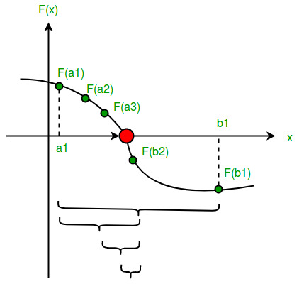

# Numerical Methods in R and Python


When using computers to solve a problem, one approach is to fully understand the solution before attempting to write a program to solve the problem.
It is often very useful to conceptualize the calculation first and then use a concise specification from which to write the program.
This approach takes advantage of the fast and reliable computation of modern computers: computers can perform calculations more quickly and reliably than humans can by hand.

However, computers are capable of much more.
The above approach is very limited in terms of the nature of problems that can be solved.
Computers can be used to solve problems that you don't know how to solve. 
You can use computers to help you understand a problem as you formulate a solution procedure. 
The most important ingredient is having a precise way of stating the problem. 
In the following we will consider three types of computing problems:

1. Solving a *system of linear equations* for a vector of unknown parameters. 
1. Finding the *root of a non-linear function*, i.e., a parameter input that returns a value of zero from that function. 
1. Solving an *optimization problem*: finding a parameter input that achieves the maximum or minimum value of a particular objective funtion. 


## Solving Linear Equations

### The problem

First, consider solving a *system of linear equations* for a vector of unknown parameters. 
The objective is to find a *vector* ```x``` that, when multiplied by the *matrix* ```A``` produces the *vector* ```b```: ```x``` satisfies ```A %*% x == b```.


### The solution

An inefficient way to solve this problem is to find the *inverse* of the matrix ```A``` and multipy it against ```b```. 
This works but it takes many more computational steps. 
A better approach is to use row oprations to perform a form of Gaussian elimination. 
Although this may be the approach taken for hand calculations, there are other, more efficient algorithms for finding the solution to a set of equations.
This is a specialized area within mathematics that uses advanced theories in linear algebra to calculate solutions. 
Fortunately, for the practitioner, most computational packages have built-in functions for solving systems of linear equations. 

### Examples

The conceptually simple--but computationally expensive--approach is to calculate the inverse of the matrix ```A``` and then multiply ```b``` to achieve the solution ```b```. 


```

```
This is useful if the user needs to solve a series of equations with the same matrix ```A``` but a set of different different vectors ```b```.

In general, you would simply solve the system to obtain the solution. 
This requires fewer calculations and is all that is needed when only the solution is required. 

```

```


In the linear regression model, the objective is to find the value of the coefficients that minimize the sum of squared errors. 
This solution is often reduced, using calculus, to solution of a set of linear equations. 


## Solving for Roots

### The problem

When finding the *root of a non-linear function*, the goal is to find a parameter input that returns a value of zero from that function. 
It is common notation to refer to the parameter as ```x``` and the function as ```f(x)``` or to solve for ```x``` such that ```f(x) = 0```. 
The parameter ```x``` can be a vector and there can be multiple solutions, depending on the function. 
Technically speaking, solving a system of linear equations can also be thought of as a root-finding problem: it solves for the root ```x``` of ```f(x) = A %*% x - b = 0```. 
There is one more element of complexity when the function is nonlinear. 

### The solution

There are several algorithms for finding the root of a function and the following selection illustrates the nature of the solution and the type of situation in which it applies. 

#### Grid Search

While not favored in terms of computational expense, one approach is to calculate a vector of values. 


```
# Define function.
quad_fn <- function(x, a, b, c) {
    # Note that this calculation also operates on vectors. 
    f <- a*x^2 + b*x + c
    return(f)
}
a <- 1/4
b <- 1 
c <- -1
# Calculate function values across a grid of values of x.
x_grid <- seq(-10, 5, by = 0.01)
f_grid <- quad_fn(x_grid, a, b, c)
```

It is often very helpful to plot the function to get an idea of where the root might be located.

```
plot(x_grid, f_grid, type = 'l', col = 'blue', 
    main = 'Plot of f(x) = quad_fn(x_grid, a, b, c)', 
    xlab = 'x', ylab = 'f(x)')
abline(h = 0)
```

From the plot, we can see that there are two roots, one near -5 and the other near 1 and two. 
We can select the value of ```x``` such that the absolute value of ```f(x)``` is minimized, using the ```which.min()``` and ```abs()``` functions in ```R```. 

```
x_root <- x_grid[which.min(abs(f_grid))]
print(x_root)
```

This approach is fairly foolproof but it is limited in scope because it is 
computationally expensive to evaluate the function at all candidate values
and the accuracy is limited by the step size between grid points. 
Other approaches are designed to take fewer steps to approach roots using information from more than one point at a time. 


#### Bisection Method

A common approach is the bisection method, in which the algorithm bisects an interval to progress to a subinterval that should contain a root.
It continues recursively, selecting smaller and smaller subintervals, up to 
the required degree of accuracy. 
In order for this algorithm to work, the function ```f(x)``` must be continuous and the first iteration has to be initialized such that ```f(x)``` has a different sign at each of the initial endpoints. 


The algorithm proceeds by evaluating ```f(x)``` at the midpoint and then replacing the endpoint of the same sign with the midpoint, creating an interval of half the width that contains the root. 



The algorithm proceeds until the desired number of iterations are performed. 
This approach is reliable but is also fairly expensive to execute because it 
moves slowly taking steps of a fixed length. 

#### Secant Method

A root-finding algorithm can be made more efficient if it takes advantage of the slope of the function. 
One method that does this is the secant method. 
It works by taking a secant line, the line that connects two points on the function, and taking the next step to the root of this line, which can be solved easily. 
The calculation proceeds as follows.


Graphically, the algorithm is initialized with two points, ```x_0``` and ```x_1``` and calculates the next candidate for a root at ```x_2```. 
Proceeding to use the pair of points ```x_1``` and ```x_2```, the algorithm next predicts ```x_3``` as a root. 
Although ```x_3``` is further from the root, it allows a close approximation in the next iteration using points ```x_2``` and ```x_3``` for the next secant line. 


#### Newton's Method

Newton's method uses calculus to get a more accurate measurement of the slope at a given point on the function. 
It chooses the next candidate point by solving for the root of the tangent line at the current point. 
The solution of this linear equation is represented by the following recurrence relation. 


Graphically, the first step looks as follows. 


The iterations continue until the desired accuracy level is achieved. 


### Examples

The ```uniroot``` function in ```R``` uses the bisection method to solve for a root of a univariate function, i.e. with one-dimensional ```x```. 

```

```

In Python, the ```Brent``` algorithm serves a similar purpose and also applies to a single-variable problem. 

```

```

For more flexible algorithms see the folowing examples that take advantage of the information contained in the slope of the function. 
It is especially useful for speeding up calculations in a multi-variable problem. 


```

```


```

```


## Optimization

### The problem

Solving an *optimization problem* involves finding a parameter input that achieves the maximum or minimum value of a particular objective funtion. 
The problem is similar in nature to the root-finding problem, except that the objective is to search for a root of the derivative of the function. 
An optimum will be located where the function is flat, that is, where the slope of the function is equal to zero. 

### The solution

Let's consider Newton-Raphson method, inspired by Newton's method for finding roots, with due credit given to Joseph Raphson. 
The idea behind this algorithm is the same as that for finding roots:
calculate a second-order approximation to the function at the current point
and then solve this approximation for its optimum. 
The optimum of the approximation is used as the next step toward the optimum of the function. 
The recurrence relation for the Newton-Raphson method is shown below for both the single-variable and multi-variable optimization problems. 


Graphically, the algorithm proceeds as shown in the following two figures. 


### Examples


```


```


As mentioned above, in the linear regression model, the objective is to find the value of the coefficients that minimize the sum of squared errors. 
Similarly, in the logistic regression model, the objective is to find the value of the coefficients that maximize the likelihood of the sample. 
This solution differs for the logistic regression model in that it is no longer possible to reduce the problem to a system of linear equations: it is inherently a nonlinear problem. 
However, the solution is not as different as one might imagine, since the intermediate steps are very similar as the algorithm approaches the solution by iteration. 
In fact, in each step of the multivariate optimization with the Newton-Raphson method, the step is calculated by solving a linear system of equations at each step. 


